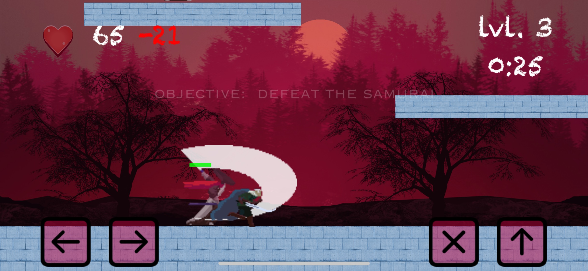

## Revert the Curse!

While out on an excursion for a few days, a sneaky mage cast a curse transforming you! Now no one will recognize you, and you can't return home. 

### About Cursed

More levels will be added! 
The main objective is to undo the curse as quickly as possible. Those who play carefully will get rewarded 
with a health points bonus to their score. 

```markdown
Some of the action: 




- Bulleted
- List

1. Numbered
2. List

**Bold** and _Italic_ and `Code` text

[Link](url) and 
```

For more details see [GitHub Flavored Markdown](https://guides.github.com/features/mastering-markdown/).

### Jekyll Themes

Your Pages site will use the layout and styles from the Jekyll theme you have selected in your [repository settings](https://github.com/tridentget/portfolio/settings/pages). The name of this theme is saved in the Jekyll `_config.yml` configuration file.

### Support or Contact

Having trouble with Pages? Check out our [documentation](https://docs.github.com/categories/github-pages-basics/) or [contact support](https://support.github.com/contact) and we’ll help you sort it out.
